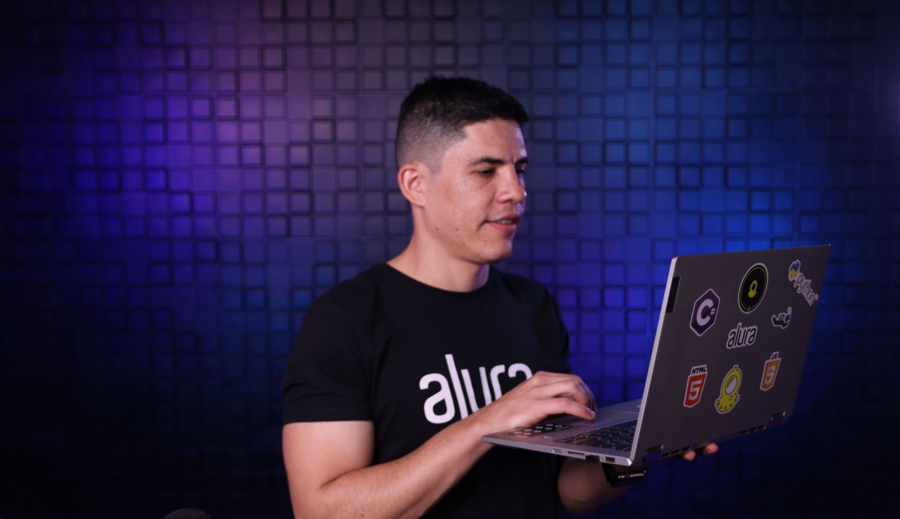

<h1 align="center"> PROGRAMA ONE - ALURA </h1>

 <h1 align="center"> Front End G6 - ONE </h1>

# Curso : Practicando React: Challenge Aluraflix"!

🥇 💻 Desarrollo del proyecto Aluraflix:   

El proyecto del curso es Implementar: React
Challenge React
Este challenge es una forma de aprendizaje. Es un mecanismo donde podrás comprometerte 
en la resolución de un problema para poder aplicar todos los conocimientos adquiridos en la formación React.

     

### ¡Bienvenido a mi AluraFlix!

     
     

 
  ❤️ ESTADO: Finalizado
 

## 🔎 Deploy

  <h3>
    <a href="https://alura-flix-rho-ten.vercel.app/" >
      🔗 Visitar la Pagina AluraFlix
    </a>

 

## 🛠️ Herramientas implementadas 
  - NodeJS
  - JSON-server
  - API
  - DOM
  - Layouts
  - Flexbox
  - CSS
  - HTML
  - JavaScript
  - Figma
  - React
  - Vite
  - Vercel
  - - Git || GitHub || GitHub Pages

    

 

 

## 📧 Contacto
¿Tienes un proyecto en mente? Conectémonos y hagamos que las cosas sucedan! Puedes escribirme a carolinalopezdatascientist@gmail.com o seguirme en [LinkedIn](https://www.linkedin.com/in/carolina-lopez-430208106/).
  

